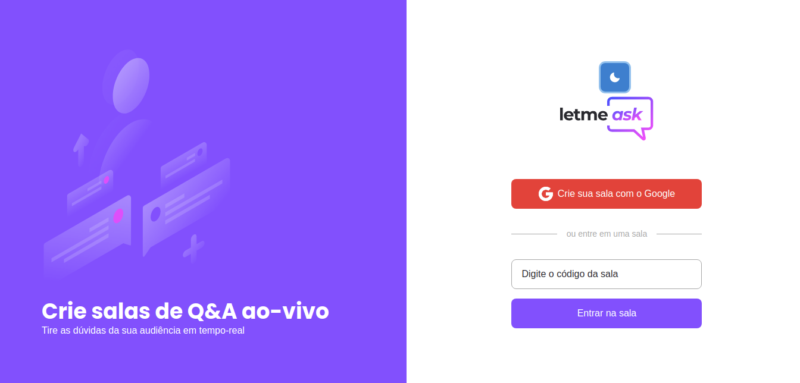
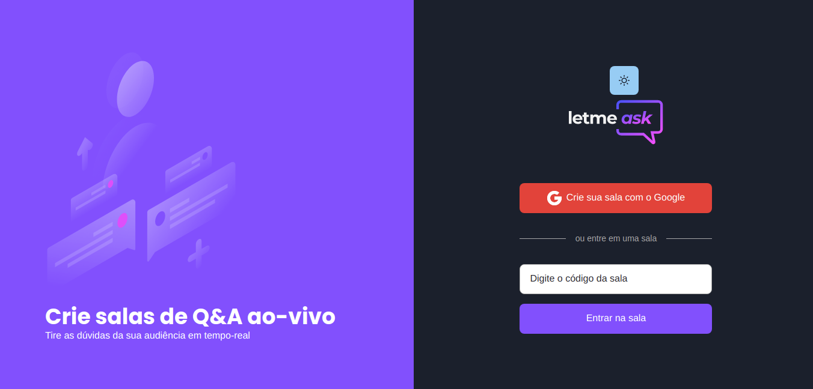
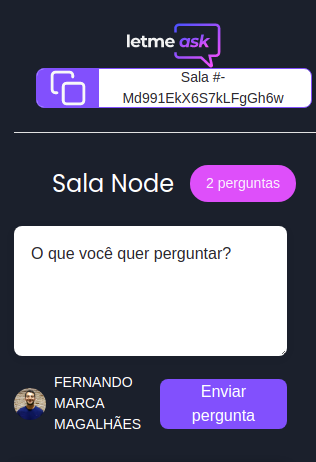
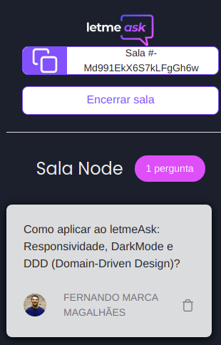
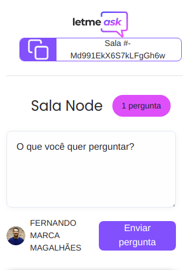
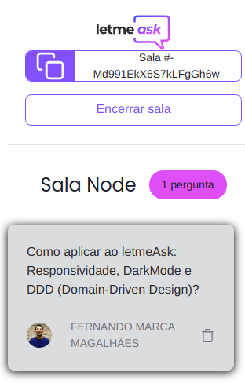

<h1>Projeto LetMeAsk</h1>

LetMeAsk é um projeto desenvolvido em React durante ao #NLW 6 - Rocketseat.
Foi adicionado ao projeto como diferencial:

- Responsividade adequada para Mobile;
- Funcionalidade para mudança de Tema (Dark e Light);
- Refatoração do projeto para o modelo DDD (Domain Driven Design), o objetivo é facilitar a implementação de regras e processos mais complexos, divisão de responsabilidades por camadas e que seja independente da tecnologia utilizada e transformar a aplicação voltada para o domínio do negócio.

## 🚀 Tecnologias

Esse projeto foi desenvolvido com as seguintes tecnologias:

- [React]
- [Firebase]
- [TypeScript]
- [Sass]
- [Chakra-UI]

## 💻 Projeto

  <h4>Features:</h4>
  <ul>
    <li>Autenticação pelo Google</li>
    <li>Tema Dark e light</li>
    <li>Perguntas e respostas em tempo real</li>
    <li>O usuário pode enviar uma pergunta</li>
    <li>O usuário pode dar Like em uma pergunta</li>
    <li>O Admin pode deletar uma pergunta</li>
    <li>O Admin pode dar check na pergunta respondida</li>
    <li>O Admin pode dar Highlight na pergunta</li>
    <li>O Admin pode encerrar uma sala</li>
  </ul>

## 🔖 Layout

<table>
  <tr>
    <td><strong>Home</strong></td>
   
  <tr>
   <tr>
    <td></td>
    <td></td>
  <tr>
</table>

<table>
  <tr>
    <td><strong>Room</strong></td>
    <td><strong></strong></td>
  <tr>
   <tr>
    <td></td>
    <td></td>
    <td></td>
    <td></td>
</table>

## Licença

Esse projeto está sob a licença MIT.

Execute yarn install ou npm install para instalação.
